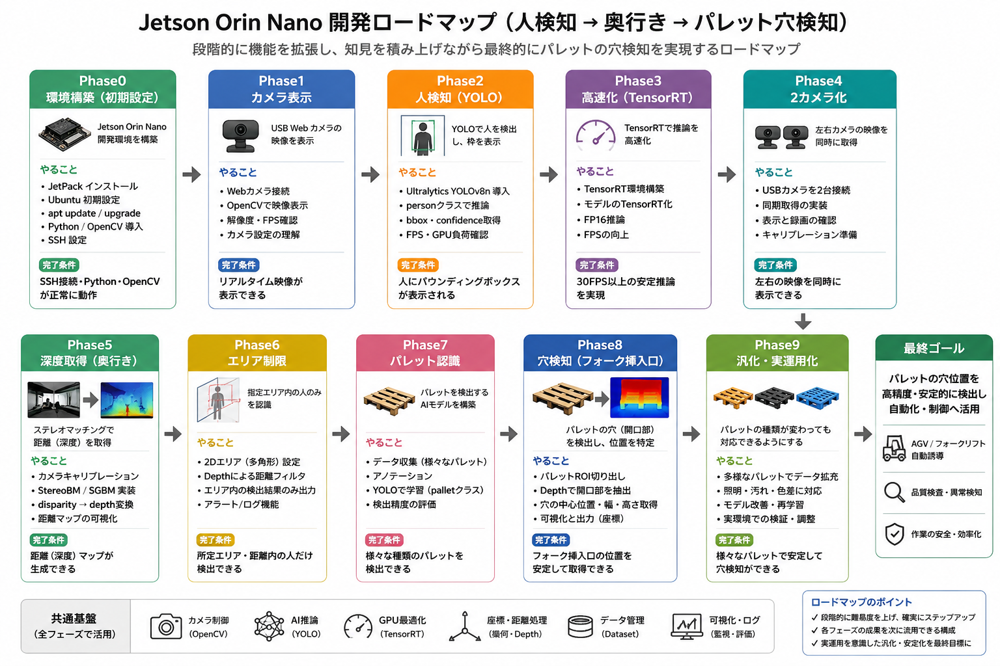

# Jetson Orin Nano 人検知・奥行き・パレット穴検知システム 開発まとめ

## 1. プロジェクトの目的

Jetson Orin Nano を用いて、以下を実現するシステムを段階的に開発する。

- 人検知（YOLO）
- ステレオカメラによる奥行き取得
- 距離制限エリア判定
- パレット認識
- パレット穴位置検出
- フォーク挿入支援

最終的には、AGV やフォークリフトなどの自動化・安全支援へ活用できるレベルを目指す。

---

# 2. 最終ゴール

## 実現したいこと

パレットの穴位置を高精度・安定的に検出し、以下へ応用する。

- フォークリフト自動挿入
- AGV の自動誘導
- 品質検査
- 安全監視
- 作業効率化

---

# 3. システム全体構成

## ハードウェア構成

### 使用デバイス

- Jetson Orin Nano
- USBカメラ（C270系）
- ディスプレイ

### Jetson Orin Nano 内部構成

- CPU : ARM Cortex-A78AE
- GPU : NVIDIA Ampere
- CUDA Core : 1024 cores
- メモリ : 8GB LPDDR5

---

# 4. ソフトウェア構成

## OS層

- Ubuntu 22.04
- NVIDIA Driver
- V4L2
- GStreamer
- X11 / Qt

---

## ミドルウェア層

### CUDA Toolkit

GPU計算を実行するための基盤。

主な役割：

- CUDA Runtime
- cuBLAS

---

### cuDNN

ディープラーニング向け高速化ライブラリ。

YOLO 推論を GPU 上で高速実行するために使用。

---

## アプリケーション層

### Python 3

全体制御を担当。

---

### OpenCV (cv2)

役割：

- カメラ映像取得
- 画像処理
- 描画
- 表示

主な機能：

- VideoCapture()
- rectangle()
- putText()
- imshow()

---

### Ultralytics YOLOv8

役割：

- 人検知
- パレット検知

処理内容：

1. 前処理
   - リサイズ
   - 正規化
   - LetterBox

2. 推論
   - YOLOモデル実行

3. 後処理
   - NMS
   - クラス判定
   - 信頼度処理

---

### PyTorch

YOLO の内部実行エンジン。

役割：

- Tensor演算
- GPU制御
- 自動微分

CUDA + cuDNN 経由で GPU 上で動作。

---

# 5. 現在のデータフロー

## 処理の流れ

1. USBカメラ映像取得
2. OpenCV がフレーム生成
3. YOLOv8 が GPU 推論
4. OpenCV が結果描画
5. 画面表示

---

# 6. 開発ロードマップ

---

# 7. 技術的なポイント

## OpenCV の役割

主に CPU 側で動作。

担当：

- カメラ制御
- 描画
- 表示
- 画像処理

---

## YOLO の役割

GPU 推論処理。

担当：

- 人検知
- パレット検知

PyTorch 上で実行され、CUDA + cuDNN を経由して GPU を利用。

---

## TensorRT の役割

Jetson 向け推論高速化。

目的：

- FPS向上
- 遅延削減
- 消費電力削減

---

# 9. まとめ

このプロジェクトは、

「人検知 → 距離認識 → パレット認識 → 穴検知」

へ段階的に発展させる構成になっている。

Jetson Orin Nano の GPU を活用し、

- OpenCV
- YOLOv8
- PyTorch
- CUDA
- TensorRT

を組み合わせることで、リアルタイムAI画像認識システムを構築する。

最終的には、フォークリフトやAGV向けの実用的な位置認識システムを目指す。
