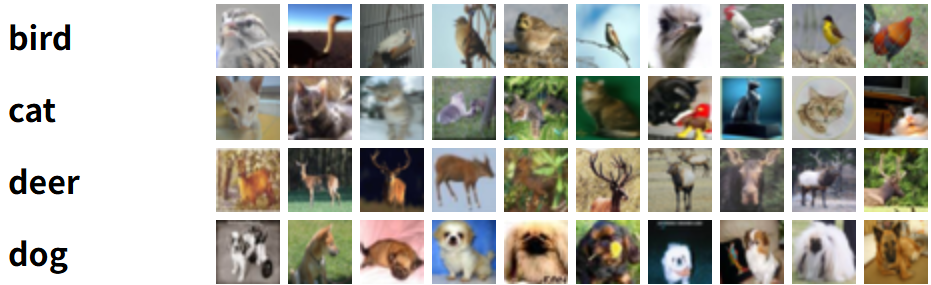
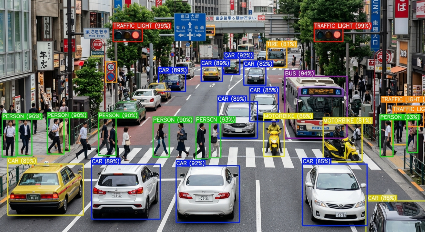
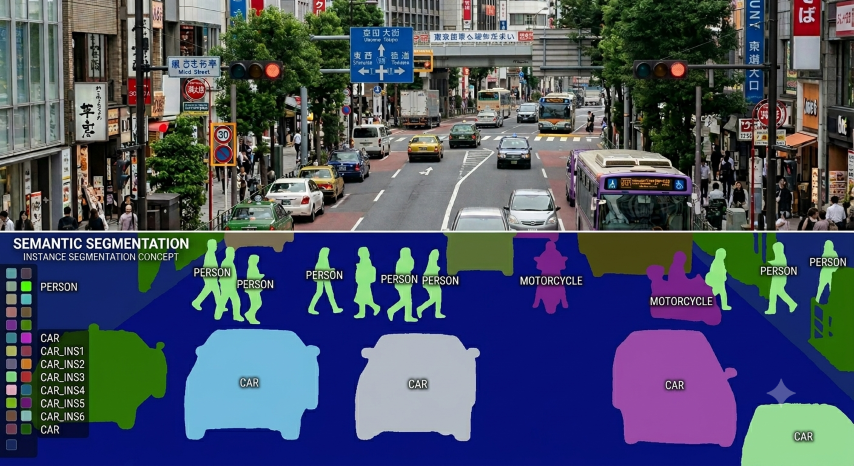
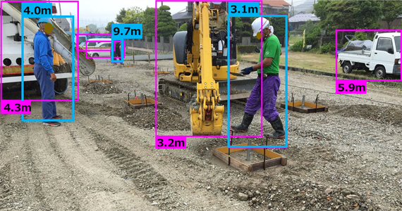
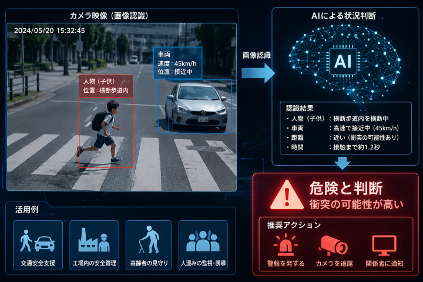

# 画像認識技術の段階

<div style="text-align: right;">2026.06.19 水野</div>  

## 1. 概要

画像認識技術は、単純な画像処理から始まり、物体認識、位置推定、判断、自律制御へと発展している。

近年では、AI（深層学習）を利用することで、画像内の物体を高精度に認識し、産業設備の自動化や安全監視などに利用されている。

---

# 画像認識の発展段階

| 段階 | 技術 | 内容 | 例 |
|---|---|---|---|
| Lv0 | 画像取得 | カメラから画像データを取得 | USBカメラ、産業用カメラ |
| Lv1 | 画像処理 | 画像を加工・解析しやすくする | 二値化、エッジ検出、フィルタ処理 |
| Lv2 | 画像分類 | 画像全体が何であるか判定 | 車、人、製品の分類 |
| Lv3 | 物体検出 | 画像内の物体の種類と位置を検出 | YOLOによる人検知 |
| Lv4 | セグメンテーション | 物体の輪郭をピクセル単位で認識 | 人の形状抽出、穴形状検出 |
| Lv5 | 位置・距離推定 | 物体の3次元位置を取得 | 距離測定、座標取得 |
| Lv6 | 状態認識・判断 | 認識結果から状況を判断 | 危険エリア侵入検知 |
| Lv7 | 自律制御 | AI判断で機器を制御 | PLC制御、ロボット制御 |
| Lv8 | 自己改善AI | データを利用して継続的に性能向上 | アクティブラーニング |

---

# 各段階の詳細

## Lv0：画像取得

カメラから画像データを取得する段階。

### 使用機器例

- USBカメラ
- 産業用カメラ
- 深度カメラ

---

## Lv1：画像処理

AIによる認識前に画像を加工する技術。

### 代表例

- 二値化
- 色抽出
- ノイズ除去
- エッジ検出

従来の画像検査装置では、この段階の処理が多く利用されていた。

---

## Lv2：画像分類（Classification）

画像全体を分類する技術。



例：

```
入力画像
 ↓
AI
 ↓
「犬」
```

特徴：

- 画像内に何があるか判断
- 位置情報は取得できない

---

## Lv3：物体検出（Object Detection）

画像内の物体の種類と位置を検出する技術。（2D）    



代表的なモデル：

- YOLO
- Faster R-CNN
- SSD

例：

```
入力画像
 ↓
YOLO
 ↓
人を検出
 ↓
Bounding Box取得
```

取得情報：

- 物体種類
- 座標
- 幅、高さ
- 信頼度

---

## Lv4：セグメンテーション（Segmentation）

物体をピクセル単位で認識する技術。



物体検出との違い：

| 技術 | 認識範囲 |
|---|---|
| 物体検出 | 四角形で囲む |
| セグメンテーション | 物体の形状を抽出 |

取得できる情報：

- 輪郭
- 面積
- 正確な中心位置
- 形状変化

### 産業用途例

- 製品外観検査
- キズ検査

---

## Lv5：位置・距離推定

画像から3次元情報を取得する段階。



使用技術：

- ステレオカメラ
- 深度カメラ

取得情報：

```
X座標
Y座標
Z座標（距離）
```

用途：

- ロボット位置補正
- 人との距離測定
- 自動搬送

---

## Lv6：状態認識・判断

認識結果からAIが状況を判断する段階。



例：

```
人を検出
 ↓
危険エリア内か確認
```

単なる検出から、安全制御や設備判断へ発展する。

---

## Lv7：自律制御

AIの判断結果を設備制御へ利用する段階。

例：

```
カメラ
 ↓
AI認識
 ↓
判断
 ↓
PLC
 ↓
装置制御
```

用途：

- ロボット制御
- 搬送設備
- 安全装置

---

## Lv8：自己改善AI

AI自身が不足データを発見し、性能向上につなげる段階。

### アクティブラーニング

```
AI検出
 ↓
自信が低い画像を抽出
 ↓
人間が確認
 ↓
再学習
 ↓
精度向上
```

メリット：

- 学習データ作成量の削減
- 実環境への適応
- 継続的な精度改善

---

# 現在のAI画像認識開発例

## 人検知システム

```
カメラ
 ↓
YOLO
 ↓
人物検出
 ↓
危険領域判定
 ↓
GPIO出力
 ↓
PLC停止
```

該当レベル：

- Lv3：物体検出
- Lv5：距離推定（追加可能）
- Lv6：安全判断
- Lv7：設備制御

---

## パレット位置検出

```
カメラ
 ↓
YOLO / Segmentation
 ↓
位置取得
 ↓
座標補正
 ↓
搬送位置調整
```

該当レベル：

- Lv3：パレット検出
- Lv4：パレット形状認識
- Lv5：位置推定
- Lv7：自動制御

---

# まとめ

画像認識は単なる「物を見る技術」から、

**検出 → 理解 → 判断 → 制御 → 自己改善**

へ進化している。

産業用途では、物体検出（YOLO）を入口として、セグメンテーション、3D認識、AI判断、設備制御へ発展させることで、高度な自動化システムを構築できる。