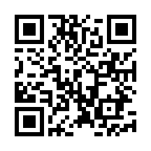

# 📌 GitHubリポジトリ紹介

---

## 🔗 リポジトリ情報

- **リポジトリ名**：Image-Recognition
- **URL**：https://github.com/Mizuno-b/Image-Recognition
- **QRコード**：  
  

---

## 🎯 目的

このリポジトリは、以下の目的で作成されています。

- ①：画像認識モデルの検証
- ②：リアルタイム推論実装
- ③：実運用を想定した最適化(人検知、パレット認識)

---

## 🧠 概要

本開発では、画像認識技術の獲得を目指す。  

- 実現目標①：リアルタイム人検出
- 実現目標②：パレット穴位置検出

---

## ⚙️ 使用技術

- Python 3.x
- OpenCV
- PyTorch / YOLOv8   
etc.

---

## 🧩 技術展開
 - 人追尾、タイヤ認識、ジャッキポイント認識等
