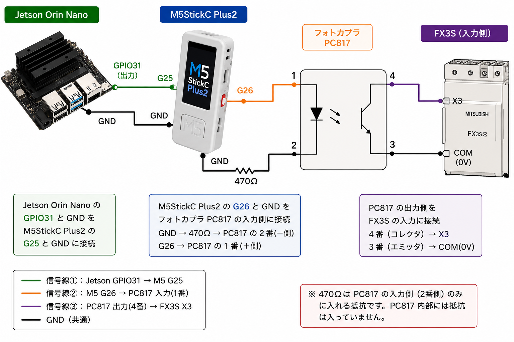

# Jetson GPIO → PC817 フォトカプラ駆動 調査まとめ

## 構成

```
Jetson 40pin GPIO
    │
  TXB0108（レベル変換IC）
    │
  PC817（フォトカプラ）入力側LED
    │
   GND

フォトカプラ出力側 → FX3S（三菱PLC）
```

---

## 問題

JetsonのGPIOから直接PC817を駆動しようとしたが、**フォトカプラがONしなかった。**

---

## 原因調査

### Jetson 40pinヘッダーの仕様

Jetsonの40pinヘッダーのGPIOピンは、SoCとTXB0108（TIのレベル変換IC）を経由して外部に出ている。

| 項目 | 値 |
|---|---|
| Pin Drive Max Current | **±20μA** |
| 信号レベル | 3.3V |

### TXB0108とは

- 電圧レベルを自動方向検出で変換するIC
- 出力ドライバが**意図的に弱く設計**されている
- より強い信号源があると「上書き」される設計

### PC817の駆動に必要な電流

FX3S（三菱PLC）の入力回路への信号伝達にPC817を使用。
一般的なフォトカプラ駆動には**数mA**のオーダーが必要。

→ TXB0108の±20μAでは**全く不足**のため、ONできなかった。

---

### PC817 LEDのVf（PC817データシートより）

| パラメータ | 最小 | 標準 | 最大 |
|---|---|---|---|
| 順電圧 VF（IF=20mA） | - | 1.2V | 1.4V |

---

## 解決策

**M5Stickを経由することで解決。**

M5StickのGPIOは数mA以上を直接出力できるため、PC817のLEDを問題なく駆動できた。



---

## 教訓

| 項目 | 内容 |
|---|---|
| Jetson 40pin GPIO | TXB0108経由で±20μAしか出せない |
| フォトカプラ駆動 | mAオーダーの電流が必要 |
| 解決策 | M5StickなどmAを出力できるデバイスを経由する |

